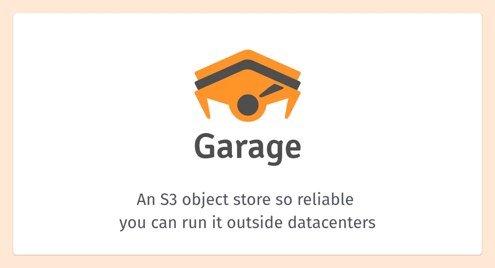

Eu estava organizando o meu site pessoal, que é um dos projetos que estou retomando para deixar com a minha cara e manter um log de tudo que eu faço. Como parte disso, passei ele por uma IA para analisar o conteúdo e me dar sugestões de melhoria.

Entre os pontos que ela levantou, um me pegou. A chamada do meu site diz que eu hospedo e rodo os meus projetos pessoais em VPS, e o link do meu currículo aponta para um Google Drive. Não fez sentido nenhum: eu tenho um servidor de pé e não tenho um S3 meu para guardar um PDF.

Então resolvi criar o meu próprio S3 com o [Garage](https://garagehq.deuxfleurs.fr/). Pesquisei vários antes, e esse ganhou por ter boa avaliação, documentação decente e já vir no catálogo de aplicações prontas do Coolify. Instalar foi simples. Fazer funcionar rendeu algumas descobertas que eu não esperava.

## Por que o Garage

O reflexo seria o MinIO, que durante anos foi o nome automático para "S3 self-hosted". Só que esse reflexo está velho. A versão community foi desmontada aos poucos: o console admin saiu, os binários e as imagens Docker pararam de ser publicados, e no fim o repositório foi arquivado. O template continua no catálogo de vários painéis, o que torna fácil instalar hoje um software que não recebe mais patch de segurança.

O Garage é um projeto open source, feito pela [Deuxfleurs](https://deuxfleurs.fr/), um coletivo francês sem fins lucrativos. É escrito em Rust, distribuído como binário único, sem dependências externas, e, o mais importante para mim, tem build nativo para ARM64, que é a arquitetura da minha VPS na Oracle. Virou a recomendação mais comum nas comunidades self-hosted depois do fim do MinIO.

Ele é leve de verdade, roda tranquilo nos 2 núcleos que eu tenho na VPS, fala S3 com assinatura SigV4 e armazena com compressão e deduplicação. As limitações que encontrei foram duas: não tem versionamento de objeto e não tem console web oficial. Nenhuma pesa no meu caso, que é servir assets do portfólio, uploads de pipeline e backup.



## O template do Coolify

Em parte, instalar o Garage no Coolify é simples mesmo. Ele já vem no catálogo one-click, e o template gera as variáveis e um `garage.toml` como file mount na aba Persistent Storage. Deploy, container sobe.

Só que não funcionou na primeira vez. O container subiu, ficou verde no painel, e nenhuma requisição voltava resposta que prestasse. Foram algumas idas ao log até achar o motivo de verdade, e no caminho eu quase consertei o que não estava quebrado.

## O suspeito errado

A primeira coisa que me pareceu errada foi o `garage.toml`. As três linhas de segredo do template vinham assim:

```toml
rpc_secret_file = "env:GARAGE_RPC_SECRET"

[admin]
admin_token_file = "env:GARAGE_ADMIN_TOKEN"
metrics_token_file = "env:GARAGE_METRICS_TOKEN"
```

Fui atrás na [documentação do Garage](https://garagehq.deuxfleurs.fr/documentation/reference-manual/configuration/) e esse esquema `env:` não existe lá. O que existe é `rpc_secret` recebendo o valor direto, `rpc_secret_file` recebendo um caminho de arquivo no disco, ou a variável de ambiente `GARAGE_RPC_SECRET` carregando o valor. Tudo indicava template quebrado.

Investigando mais, o arquivo estava certo. Ele é gerado pelo próprio Coolify, e os segredos de verdade entram pelas variáveis de ambiente que o template já passa no compose, `GARAGE_RPC_SECRET`, `GARAGE_ADMIN_TOKEN` e `GARAGE_METRICS_TOKEN`, que são exatamente o mecanismo nativo do Garage. É por isso, inclusive, que o template também define `GARAGE_ALLOW_WORLD_READABLE_SECRETS=true`. Aquelas linhas estranhas nunca foram o problema, e eu não alterei nada nelas.

O erro de verdade estava em outro lugar.

## Layout not ready

O container estava de pé, os servidores escutando nas portas certas, e toda requisição no endpoint web devolvia isso:

```
GET 500 Internal Server Error web-garage.seudominio.com/
API error: Internal error: Layout not ready
```

O Garage não é como o MinIO nesse ponto. Ele não aceita escrita nenhuma antes de você definir o **[layout do cluster](https://garagehq.deuxfleurs.fr/documentation/operations/layout/)**, que é a atribuição de zona e capacidade a cada nó. Mesmo quando o cluster inteiro é um nó só. Quem vem do MinIO sobe o container e espera que funcione; aqui o container de pé é só metade do caminho.

Nas versões antigas, o layout é feito na mão:

```bash
garage layout assign -z dc1 -c 40G <NODE_ID>
garage layout apply --version 1
```

O template vinha com a imagem `v2.1.0`. A partir da `v2.3.0` existe a flag `--single-node`, que cria o layout sozinha na subida. Como a cadeia de upgrade não tem breaking change no caminho, subi a versão e usei a flag. Essa acabou sendo a única mudança que eu fiz no template:

```yaml
services:
  garage:
    image: 'dxflrs/garage:v2.3.0'
    command:
      - /garage
      - server
      - '--single-node'
```

Depois do redeploy, o log mostrou o layout sendo criado:

```
INFO garage::server: Created initial layout for single-node configuration:
Partitions are replicated 1 times on at least 1 distinct zones.
  0b4ebababb34909a  [default]  256 (256 new)  192.7 GiB
```

E o 500 virou 404, que é o erro certo para "esse host não corresponde a nenhum bucket". Debug com progresso medido em código de erro.

## A capacidade do disco é só um peso

O `--single-node` atribuiu 192.7 GiB ao nó, o disco inteiro. Minha primeira reação foi baixar esse número para reservar espaço para o resto dos serviços que rodam na mesma VPS.

Reação errada. A capacidade do nó não é limite, é **peso de distribuição**: o algoritmo de layout usa esse número para decidir quantas partições cada nó recebe. Quem impõe limite de tamanho é o filesystem. Com um nó só, o número é decorativo: as 256 partições vão todas para ele de qualquer jeito, valha 192 GiB ou 40. Baixar não protegeria nada.

O que protege de verdade são duas coisas. A quota por bucket, que é o único enforcement real:

```bash
garage bucket set-quotas --max-size 40GB <bucket>
```

E o monitoramento de disco, que no Coolify já existe, com limite configurável que dispara notificação. O risco não é teórico: os volumes vivem em `/var/lib/docker/volumes`, no mesmo filesystem do Coolify e de qualquer banco que eu subir depois. Disco cheio derruba tudo junto.

## O nome do bucket é o domínio

Como o objetivo era hospedar meu currículo de forma pública por uma URL, o próximo passo foi criar o bucket e habilitar o site. Mas eu precisava de um bucket público.

E foi na hora de criar que apareceu a descoberta mais estranha do processo: o nome do bucket não podia ser qualquer um. O endpoint web do Garage, o da porta 3902, decide qual bucket servir olhando para o Host da requisição, de dois jeitos:

1. Se o host termina com o `root_domain` configurado em `[s3_web]`, o prefixo é o nome do bucket: `meubucket.web.seudominio.com` serve o bucket `meubucket`.
2. Senão, ele procura um bucket cujo alias seja o hostname **inteiro**.

O primeiro caminho é o modo virtual-hosted, e exige certificado wildcard, o que no Coolify significa configurar DNS challenge no Traefik. Ele nem funcionaria do jeito que o template vem, aliás: o `root_domain` é gerado como `.web.garage.localhost`, que nunca vai bater com um domínio de verdade. O segundo caminho funciona com o certificado normal do Let's Encrypt. Fui no segundo, e a consequência é que o bucket precisa se chamar exatamente igual ao domínio. Daí o `bucket create web-garage.seudominio.com`.

Isso quer dizer que cada bucket público exige um domínio próprio. Para dois ou três, tudo bem; a partir daí vale investir no wildcard. Bucket privado não tem essa restrição e pode se chamar o que quiser.

Pelo mesmo motivo, na API S3 eu uso path style: `addressing_style = path` no aws CLI, `forcePathStyle: true` no SDK de JavaScript. Sem isso, o cliente monta `bucket.s3-garage.seudominio.com` e o certificado não cobre.

**Faltava o cadeado.** O https funcionava, mas acessar por http servia a página em texto claro, sem redirecionar. O Coolify decide isso pelo esquema que você digita no campo de domínio: sem o `https://` na frente, ele não gera o middleware de redirect no Traefik. Editei o domínio para `https://web-garage.seudominio.com` e fiz **Redeploy**. Tem que ser deploy mesmo: as labels do Traefik só são reescritas nele, restart não basta.

## A imagem não tem shell

Na hora de criar os buckets, fui abrir o terminal web do Coolify e levei um:

```
Terminal Not Available
No shell (bash/sh) is available in this container.
```

A imagem do Garage é distroless: o binário estático e mais nada. Sem shell, sem coreutils. Ótimo para tamanho e superfície de ataque, ruim para ferramentas que assumem que existe um `sh` do outro lado.

Só que eu não precisava de um shell, precisava executar o binário. Via SSH no host:

```bash
docker exec <container> /garage bucket create web-garage.seudominio.com
```

Sem `-it`, sem invocar shell nenhum. Funciona. E é pelo mesmo motivo que o healthcheck do template usa a forma de lista, com `CMD` chamando `/garage stats -a` direto, em vez de `CMD-SHELL`: não tem shell para interpretar linha de comando ali dentro.

## O modelo de segurança

Antes dos comandos, vale entender a estrutura, porque ela é mais simples que a da AWS, e saber disso poupa tempo procurando coisa que não existe.

São três portas, cada uma com a própria credencial:

| Porta | O quê | Credencial |
|---|---|---|
| 3900 | API S3, objetos | chave assinada (SigV4) |
| 3902 | endpoint web | anônimo, só buckets com site habilitado |
| 3903 | Admin API | bearer token |

E a hierarquia de permissão tem quatro níveis, sendo que o último não existe:

1. **RPC secret e admin token**: nível cluster, controle total.
2. **Chave de acesso** (`GK...` + secret): uma identidade, que nasce sem acesso a nada.
3. **Permissão por bucket**: a chave recebe `read`, `write` ou `owner` em cada bucket, um por um.
4. **Objeto**: nada. Não existe controle nesse nível.

O Garage não implementa ACL nem bucket policy no estilo AWS. É uma tabela de chave, bucket e permissão, e acabou. Não existe objeto público dentro de bucket privado, o que significa que um bucket com site habilitado é **inteiramente** público. Não misture conteúdo sensível nele.

Acesso anônimo pela API S3 simplesmente não existe, e dá para ver isso no log assim que o domínio fica público, com os scanners da internet apanhando:

```
GET / → 403 Forbidden: Garage does not support anonymous access yet
```

## Os buckets que eu criei

A regra que eu segui: bucket é fronteira de confiança, prefixo é organização. Só vale criar um bucket novo quando muda a resposta para três perguntas: quem lê, quem escreve, qual a quota.

Fiquei com três. O `web-garage.seudominio.com`, público, para os assets do portfólio. Um privado para os uploads de pipeline. E um privado só para backup. Esse separado não é organização, é contenção: se a chave da aplicação vazar um dia, os backups não estão no alcance dela.

O setup, uma vez só. O `<container>` dos comandos é o nome real do container, que dá para achar com um `docker ps` no host, procurando por garage na lista:

```bash
# cria o bucket vazio, privado
docker exec <container> /garage bucket create web-garage.seudominio.com

# liga a leitura anônima pelo endpoint web (escrita continua exigindo chave)
docker exec <container> /garage bucket website --allow web-garage.seudominio.com

# confere: procure "Website access: true"
docker exec <container> /garage bucket info web-garage.seudominio.com

# cria uma identidade (nasce sem acesso a nada)
docker exec <container> /garage key create laptop

# conecta identidade e bucket
docker exec <container> /garage bucket allow --read --write web-garage.seudominio.com --key laptop
```

O `key create` responde com o Key ID e o secret da chave.

E repare que não dei `--owner` para a chave. Foi de propósito: sem ele, uma chave vazada não consegue desligar o site do bucket nem remover a quota.


## Conectando o cliente

A partir daqui, nada mais de SSH. No notebook, o aws CLI resolve com um profile:

```bash
aws configure --profile garage
# Key ID, Secret, region = garage, formato em branco

aws configure set endpoint_url https://s3-garage.seudominio.com --profile garage
aws configure set s3.addressing_style path --profile garage
```

O Key ID e o secret que ele pede são os da chave `laptop`. Eu não tinha copiado na hora, e não foi problema: um `/garage bucket info web-garage.seudominio.com` mostra as informações do bucket, inclusive as chaves conectadas a ele, e foi lá dentro que eu peguei o que o `aws configure` pede.

O `endpoint_url` no arquivo de config exige o aws CLI 2.13 ou mais novo. Em versão antiga, é `--endpoint-url` em cada comando.

O teste:

```bash
aws s3 ls --profile garage
```

E o diagnóstico rápido, para quando não funcionar:

- `SignatureDoesNotMatch` é secret errado.
- Timeout é endpoint errado.
- `AccessDenied` é `bucket allow` faltando.

## O currículo, enfim

Tudo isso começou por causa de um PDF num Google Drive. Então o fechamento é ele saindo de lá:

```bash
aws s3 cp resume.pdf s3://web-garage.seudominio.com/assets/resume.pdf \
  --content-type application/pdf \
  --content-disposition 'attachment; filename="Luan_Martins_Resume.pdf"' \
  --profile garage
```

O `--content-disposition` é o que faz o link baixar o arquivo em vez de abrir no navegador. Precisa ir na hora do upload, porque vira metadata do objeto. Se o arquivo já estiver lá, dá para reescrever copiando o objeto sobre ele mesmo com `--metadata-directive REPLACE`, sem baixar nada.

A solução óbvia, o atributo `download` do HTML, não serve aqui: ele só funciona para links de mesma origem, e o bucket está em outro subdomínio.

O link do currículo no site agora aponta para o meu próprio servidor. A incoerência que a IA apontou lá no começo deixou de existir.

## A configuração final

Para quem só quer o resultado. O `garage.toml` fica do jeito que o template do Coolify gera, sem nenhum segredo de verdade dentro, porque eles entram pelas variáveis de ambiente:

```toml
metadata_dir = "/var/lib/garage/meta"
data_dir = "/var/lib/garage/data"
db_engine = "lmdb"

replication_factor = 1
consistency_mode = "consistent"

compression_level = 1
block_size = "1M"

rpc_bind_addr = "[::]:3901"
rpc_secret_file = "env:GARAGE_RPC_SECRET"
bootstrap_peers = []

[s3_api]
s3_region = "garage"
api_bind_addr = "[::]:3900"
root_domain = ".s3.garage.localhost"

[s3_web]
bind_addr = "[::]:3902"
root_domain = ".web.garage.localhost"

[admin]
api_bind_addr = "[::]:3903"
admin_token_file = "env:GARAGE_ADMIN_TOKEN"
metrics_token_file = "env:GARAGE_METRICS_TOKEN"
```

O compose, com a única mudança que eu fiz, a imagem e o command:

```yaml
services:
  garage:
    image: 'dxflrs/garage:v2.3.0'
    command:
      - /garage
      - server
      - '--single-node'
    environment:
      - GARAGE_S3_API_URL=$GARAGE_S3_API_URL
      - GARAGE_WEB_URL=$GARAGE_WEB_URL
      - GARAGE_ADMIN_URL=$GARAGE_ADMIN_URL
      - 'GARAGE_RPC_SECRET=${SERVICE_HEX_64_RPCSECRET}'
      - GARAGE_ADMIN_TOKEN=$SERVICE_PASSWORD_GARAGE
      - GARAGE_METRICS_TOKEN=$SERVICE_PASSWORD_GARAGEMETRICS
      - GARAGE_ALLOW_WORLD_READABLE_SECRETS=true
      - 'RUST_LOG=${RUST_LOG:-garage=info}'
    volumes:
      - 'garage-meta:/var/lib/garage/meta'
      - 'garage-data:/var/lib/garage/data'
      -
        type: bind
        source: ./garage.toml
        target: /etc/garage.toml
    healthcheck:
      test:
        - CMD
        - /garage
        - stats
        - '-a'
      interval: 10s
      timeout: 5s
      retries: 5
```

E os domínios no Coolify, os dois com `https://` na frente: `s3-garage.seudominio.com` na porta 3900, `web-garage.seudominio.com` na porta 3902, e a 3903 sem domínio público nenhum.

## O que eu faria diferente

**Ler o log inteiro antes de sair caçando culpado.** Eu quase "corrigi" um `garage.toml` que estava certo. O container estava de pé, as linhas `S3 API server listening` estavam lá desde o início, e o `Layout not ready` também. A resposta estava no log o tempo todo, eu é que fui atrás de suposição antes de ler até o fim.

**Separar o ruído do sinal.** Depois que o domínio ficou público, os scanners começaram a bater sem parar, e o healthcheck a cada 10 segundos gera três linhas por rodada. O que mais confundiu: cada conexão do healthcheck aparece com um ID diferente, parecendo nó novo entrando no cluster. Não é: é o CLI gerando uma identidade efêmera a cada invocação.

**Configurar o wildcard desde o começo, se a intenção for ter vários buckets públicos.** Nome de bucket não é renomeável. Migrar depois significa criar bucket novo e sincronizar tudo.

## Valeu a pena

Isso tudo nasceu de uma IA apontando uma incoerência boba no meu site. Terminou com armazenamento de objetos próprio, com quota, chave escopada por bucket e o currículo servido do meu servidor, pelo meu domínio.

Pelo tempo gasto, valeu. O Garage em si deu menos trabalho do que eu esperava: o que me segurou foi versão velha de template e conceito que eu não conhecia, não bug. E o que ficou de pé serve para muito mais que um PDF: agora as imagens deste log, os uploads dos meus pipelines e os backups têm para onde ir sem depender de serviço de terceiro.

Ficaram três pendências, e pelo menos uma delas vira post: o certificado wildcard, para desgrudar o nome do bucket do hostname; o [garage-webui](https://github.com/khairul169/garage-webui), que é o console web feito pela comunidade, para aposentar o SSH de vez; e os buckets, quotas e configuração de site descritos em Terraform, já que existe [provider](https://registry.terraform.io/providers/jkossis/garage/latest) para isso.
