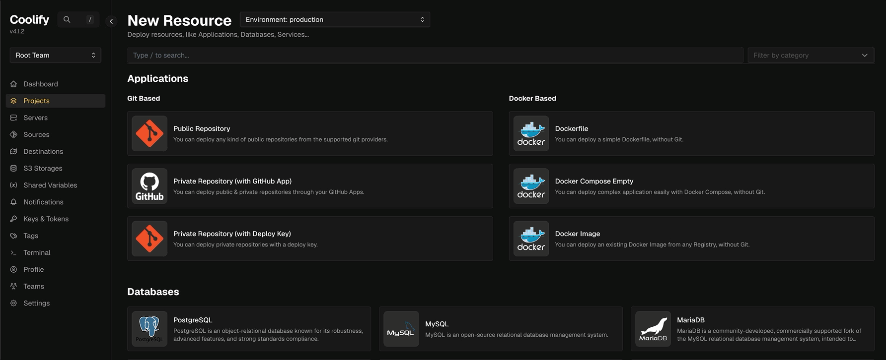
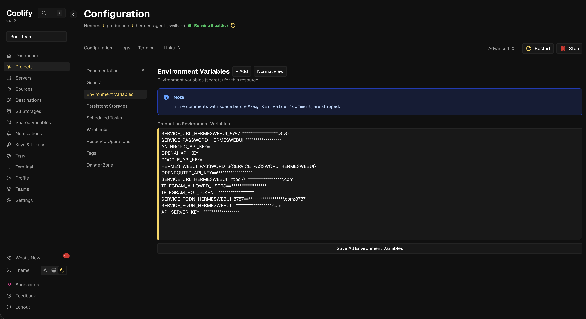
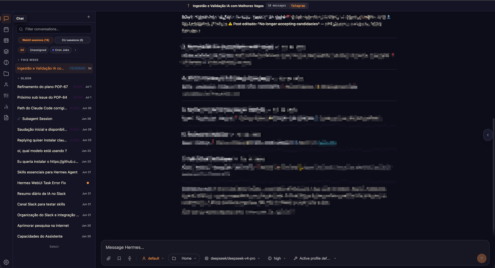

I don't usually chase hype. I kept hearing people talk about Hermes, and my first instinct was to ignore it, the same instinct that was right about OpenClaw, which almost nobody mentions anymore. I installed it anyway.

Hermes is an autonomous, self-hosted, open-source AI agent. What sets it apart is persistent memory: it doesn't start from scratch with every conversation, and it gets better the more you use it. It came after OpenClaw and changed how these tools organize that memory.

## Why

The hype died fast. Nobody talks about OpenClaw or Hermes anymore, and it feels like people forgot they exist. Or maybe they realized these things aren't a silver bullet for everything and won't run a company on their own. But "doesn't solve everything" is a long way from "doesn't solve anything."

What I wanted from it was specific. Cron jobs that hand me data without me having to ask, starting with job listings. Quick web searches without opening ten tabs. And exposing my own tools as an API, so I can get an answer out of them with a plain-text request instead of opening them one by one. That last one is also the most honest reason: I wanted a real excuse to learn how to build MCPs and use them in something I open every day.

None of that calls for an agent that runs itself. It calls for one that's always on, and that's where the VPS comes in.

## Where it runs

The instance is an Oracle ARM VPS on the free tier: 2 cores, 12GB of RAM, and 200GB of storage for $0 a month. That's enough room for Hermes with plenty left over for whatever else I want running next to it.

Nothing guarantees Oracle keeps this tier around, and I wouldn't put anything professional on it: there's no failover and no support contract. But for a personal project, and especially for anyone who wants to learn infrastructure without paying for it, it's too much hardware to pass up.

Creating and configuring the VPS is a topic for another post, one I still have to write. One thing up front: I followed [Tiago Matos](https://www.youtube.com/@tiagomatosweb)'s tutorial, which is easy to follow and covers the whole path, but managing SSH on Oracle has a gotcha that cost me some time. It's the kind of detail that deserves its own write-up.

## How I installed it

On top of the VPS I run Coolify. I've been through Portainer and Dockge, and Proxmox is still my favorite even though it works at a different layer, virtual machines instead of containers. Coolify won on simplicity: it has a catalog of ready-to-run apps, it handles the deploys, and it keeps updates one click away. It uses Traefik as its reverse proxy, so the SSL certificate comes automatically and the only thing left for me to do is point the domain.



Hermes is in that catalog, so installing it is mostly pick and click. The template spins up two containers: the agent and [hermes-webui](https://github.com/nesquena/hermes-webui), the interface for managing it without living in the terminal.

The catch is that out of the box, it doesn't work. Both containers come up, both show green in the dashboard, and the webui can't see the agent. It took four changes to the compose file before the two ends would talk to each other.

## What I had to change

**The agent wasn't exposing an API at all.** The template doesn't turn on the agent's API server, so the webui has nothing to point at. I enabled the server on the agent side:

```yaml
- API_SERVER_ENABLED=true
- API_SERVER_HOST=0.0.0.0
- API_SERVER_PORT=8642
- 'API_SERVER_KEY=${API_SERVER_KEY}'
```

And gave the webui the address:

```yaml
- 'HERMES_API_URL=http://hermes-agent:8642'
```

That `hermes-agent` isn't a domain. It's the service name from the compose file, which becomes a hostname inside the container network. Which means port 8642 never has to touch the internet: the only thing talking to it is the container next door.

**The shared volume was read-only.** The template mounts the agent's directory inside the webui with `:ro` at the end. I dropped the `:ro` so the webui can write there, not just read.

**The images came pinned.** The agent is locked to a `sha256` digest, the webui to an exact version. Great for reproducibility, terrible for my case: Coolify's update button pulls the exact same image again, forever. I switched both to `latest`. It's a deliberate choice and it has a price, which I'll get to further down.

**Telegram.** I added `TELEGRAM_BOT_TOKEN` and `TELEGRAM_ALLOWED_USERS`, which is how I talk to it day to day. This is the piece that makes "always on" worth anything: I send a request from my phone and the answer shows up without me ever opening the laptop.

## The final compose file

```yaml
services:
  hermes-agent:
    image: 'nousresearch/hermes-agent:latest'
    command: 'gateway run'
    environment:
      - HERMES_HOME=/home/hermes/.hermes
      - HERMES_UID=1000
      - HERMES_GID=1000
      - 'OPENROUTER_API_KEY=${OPENROUTER_API_KEY}'
      - 'ANTHROPIC_API_KEY=${ANTHROPIC_API_KEY}'
      - 'OPENAI_API_KEY=${OPENAI_API_KEY}'
      - 'GOOGLE_API_KEY=${GOOGLE_API_KEY}'
      - 'TELEGRAM_BOT_TOKEN=${TELEGRAM_BOT_TOKEN}'
      - 'TELEGRAM_ALLOWED_USERS=${TELEGRAM_ALLOWED_USERS}'
      - API_SERVER_ENABLED=true
      - API_SERVER_HOST=0.0.0.0
      - API_SERVER_PORT=8642
      - 'API_SERVER_KEY=${API_SERVER_KEY}'
    volumes:
      - 'hermes-home:/home/hermes/.hermes'
      - 'hermes-agent-src:/opt/hermes'
    healthcheck:
      test:
        - CMD-SHELL
        - 'test -d /home/hermes/.hermes || exit 1'
      interval: 10s
      timeout: 5s
      retries: 5
  hermes-webui:
    image: 'ghcr.io/nesquena/hermes-webui:latest'
    depends_on:
      - hermes-agent
    environment:
      - SERVICE_URL_HERMESWEBUI_8787
      - HERMES_WEBUI_HOST=0.0.0.0
      - HERMES_WEBUI_PORT=8787
      - HERMES_WEBUI_STATE_DIR=/home/hermeswebui/.hermes/webui
      - WANTED_UID=1000
      - WANTED_GID=1000
      - 'HERMES_WEBUI_PASSWORD=${SERVICE_PASSWORD_HERMESWEBUI}'
      - 'HERMES_API_URL=http://hermes-agent:8642'
    volumes:
      - 'hermes-home:/home/hermeswebui/.hermes'
      - 'hermes-agent-src:/home/hermeswebui/.hermes/hermes-agent'
      - 'hermes-workspace:/workspace'
    healthcheck:
      test:
        - CMD
        - curl
        - '-f'
        - 'http://127.0.0.1:8787/health'
      interval: 30s
      timeout: 5s
      retries: 3
```

## The environment variables

Nothing sensitive lives in the compose file. Every key and password comes in through environment variables, which in Coolify sit right on the service's own screen:

```bash
# generated and filled in by Coolify
SERVICE_FQDN_HERMESWEBUI=hermes.yourdomain.com
SERVICE_FQDN_HERMESWEBUI_8787=hermes.yourdomain.com:8787
SERVICE_URL_HERMESWEBUI=https://hermes.yourdomain.com
SERVICE_URL_HERMESWEBUI_8787=https://hermes.yourdomain.com:8787
SERVICE_PASSWORD_HERMESWEBUI=
HERMES_WEBUI_PASSWORD=${SERVICE_PASSWORD_HERMESWEBUI}

# the model providers, whichever ones you use
OPENROUTER_API_KEY=
ANTHROPIC_API_KEY=
OPENAI_API_KEY=
GOOGLE_API_KEY=

# the bridge between the webui and the agent
API_SERVER_KEY=

# Telegram
TELEGRAM_BOT_TOKEN=
TELEGRAM_ALLOWED_USERS=
```

The ones that start with `SERVICE_` are a Coolify convention: it generates the password, resolves the domain, and requests the certificate on its own. The rest are all yours.



## What the webui is for

I almost skipped the webui, figuring it would be a pretty face on top of something that already worked over Telegram. I was wrong.

What it gives you that the terminal can't is a single place. Hermes answers in several places at once: a conversation that started on Telegram, another that came in from a Slack channel, another that's a cron job running in the middle of the night with nobody asking for anything. Keeping up with all that without the webui means chasing history across three different apps. Here it all lands in one list, tagged with where it came from, and I can open any conversation and read what got done. It's also where I browse the skills I've created and check that the cron jobs actually ran.



## How I update it

With `latest` on both images, updating is just a redeploy in Coolify. It pulls the new image and brings the containers back up. The state doesn't live inside them. It lives in the `hermes-home`, `hermes-agent-src`, and `hermes-workspace` volumes, so memory and configuration survive the update without me doing anything.

The price is the trade I made above. `latest` doesn't tell me what changed, and the day an update breaks something, I'll have nowhere to roll back to without first digging up which version I was on. I accepted that because this is a personal project and the cost of being down for a weekend is zero.

## The day the bill came due

A month later, the webui was gone. It didn't fail with an error on screen, it vanished: it wasn't even showing up in Coolify's terminal selector anymore. In the logs, a single line:

```text
rm: cannot remove '/tmp/hermes-agent-build/...': Permission denied
```

Here's what the webui does at boot: it needs the agent's dependencies to work, so it copies the agent's code from the `hermes-agent-src` volume into `/tmp/hermes-agent-build`, installs there, and at the end tries to clean that `/tmp` up. The copy was created owned by `root`, and the cleanup runs as UID 1000. The cleanup fails, the boot step never finishes, and the container falls into a crash loop. A container that never comes up doesn't show in the selector, which is why it had vanished instead of erroring out.

I knew this error. It was the same one the `:ro` caused back at install time. Except the `:ro` was long gone, so the cause had to be something else. Two things had changed on their own along the way.

**The new image.** More than a month had passed since the last redeploy, and `latest` pulled in a version where the webui's install process had changed. You could tell by the `node_modules` and `eslint` showing up inside `/tmp`, things that didn't exist there before.

**The volume full of old state.** `hermes-agent-src` was still populated by the old version of the code. A new version reading old files, owned by someone else, and the cleanup tripping over a file it had no permission to remove.

## How I fixed it

**First, read the resource log, not the terminal.** Those `rm: Permission denied` lines might just be noise; what matters is whether the container dies because of them or falls over later for some other reason. The answer is in the last line before the restart, and that line is in the resource log. The terminal, at this point, doesn't even exist to be opened.

**Then, empty the code volume.** `hermes-agent-src` is the same volume on both sides, and on the agent side it's mounted at `/opt/hermes`. The agent was still standing, so I could do the cleanup from its terminal.

Before deleting anything, look:

```bash
ls -la /opt/hermes
```

That shows what's in there and, more importantly, who owns each file. It's where you can see the mix of owners causing the problem: part of it `root`, part of it user 1000.

Then the first sweep, visible files only:

```bash
rm -rf /opt/hermes/*
```

The `-r` descends into directories and the `-f` keeps it from stopping to ask about every file. And notice I'm deleting the contents, with the slash and the asterisk at the end, not the directory: `/opt/hermes` is the volume's mount point, and if it disappears the container loses the spot where the volume plugs in.

Run `ls -la` again and the directory looks empty, but it isn't. The shell's `*` doesn't match hidden files, and the agent's code has a bunch that start with a dot. Those take a second pattern:

```bash
rm -rf /opt/hermes/.[!.]*
```

That `.[!.]*` is ugly for a reason. It means "a dot, followed by anything that isn't another dot, followed by the rest of the name." If I wrote plain `.*`, the pattern would also match `.` and `..`, which are the directory itself and its parent. An `rm -rf .*` is, in practice, a request to delete everything and then climb up a level for more. The `[!.]` exists only to keep those two out.

When either pattern matches nothing, the shell hands the literal pattern to `rm`, which complains that the file doesn't exist. That's noise, not an error, and it's what the `2>/dev/null` is for: it tosses whatever comes out on the error channel.

Put it all together and you get the one-liner I actually ran:

```bash
rm -rf /opt/hermes/* /opt/hermes/.[!.]* 2>/dev/null; ls -la /opt/hermes
```

The semicolon in the middle is deliberate, not an `&&`. With `;`, the `ls` runs no matter what, even if `rm` grumbled about something, and its output is exactly what I want to see at the end: a directory with nothing left but `.` and `..`.

Then, redeploy. The agent repopulates `/opt/hermes` from scratch, already on the current version, and the webui reinstalls on top of clean code. That fixed it, and the boot finished on the first try.

The third step stayed in my back pocket: if emptying the volume hadn't fixed it, that would've meant the new webui simply doesn't get along with this two-container setup anymore, and the way out would've been pinning both images to a pair of versions I knew worked, the June ones.

The root cause is still `latest`, and I still think it's worth it for a personal project. But the second ingredient is the one I hadn't caught before: swapping the image without clearing out what the old image left in the volume is only half an update.

## Was it worth it

Back to the beginning: I installed this thing as a skeptic, expecting it wouldn't be good for much. A month in, I can say the experience as an autonomous agent is genuinely good.

It's not a replacement for everything I need, not least because it costs me time: I've spent, and still spend, a good number of hours poking at and testing new features. But it delivers what it promises.

I also made good on that most honest reason from the top. I've built an MCP and hooked it up to Hermes, and now I just ask for an update and it goes off and handles the whole thing on its own. The best part is that the answer comes back with more than the MCP's API result: it also tells me what it made of it. That MCP, and whatever comes after it, is another post I still have to write.
