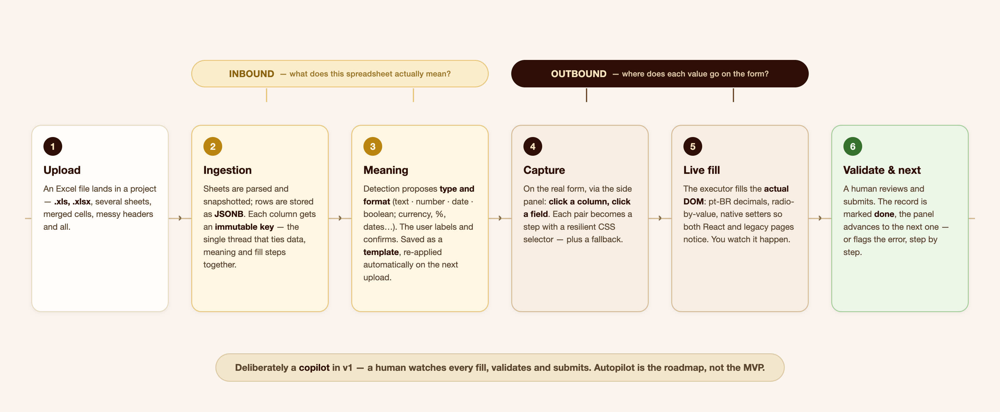
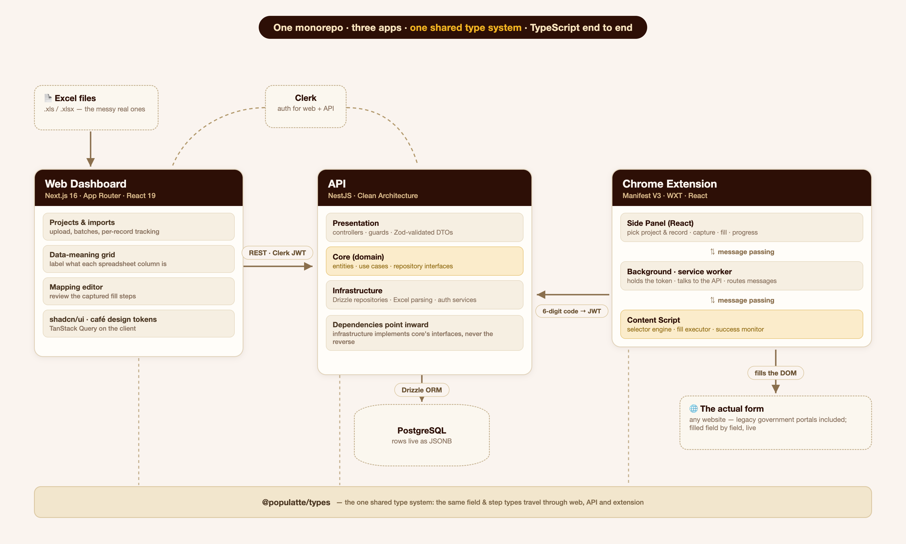
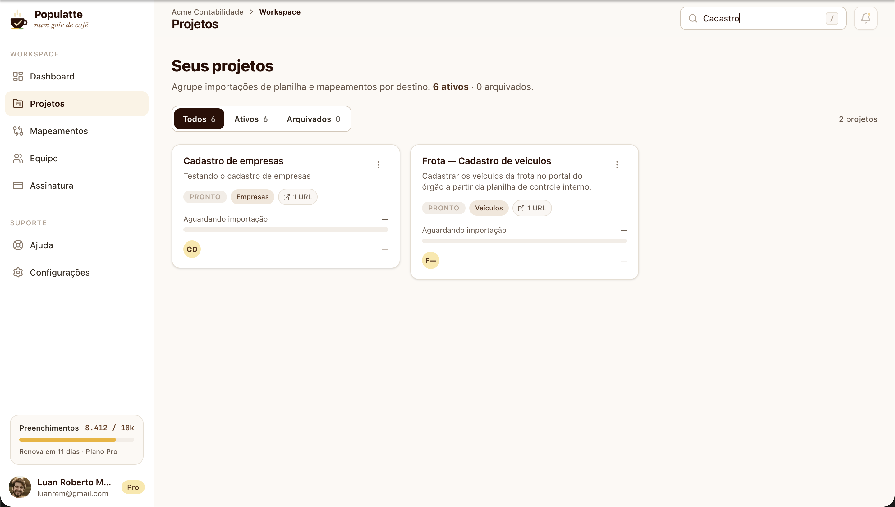
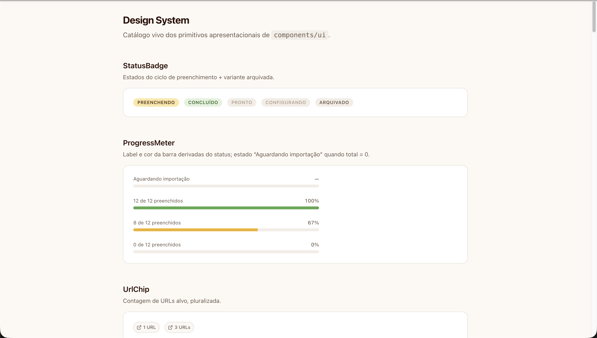
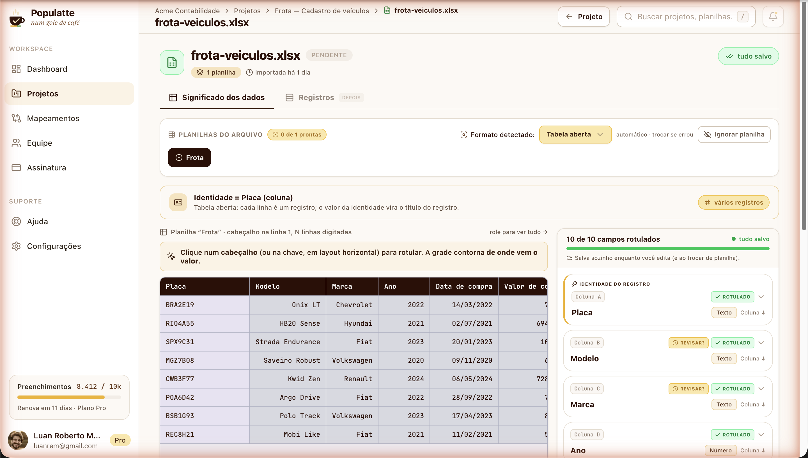
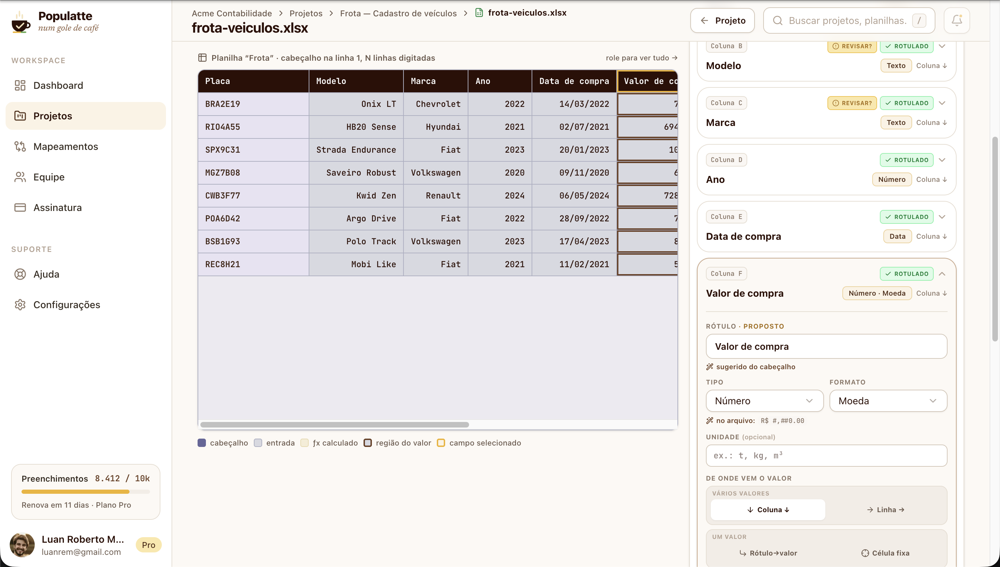
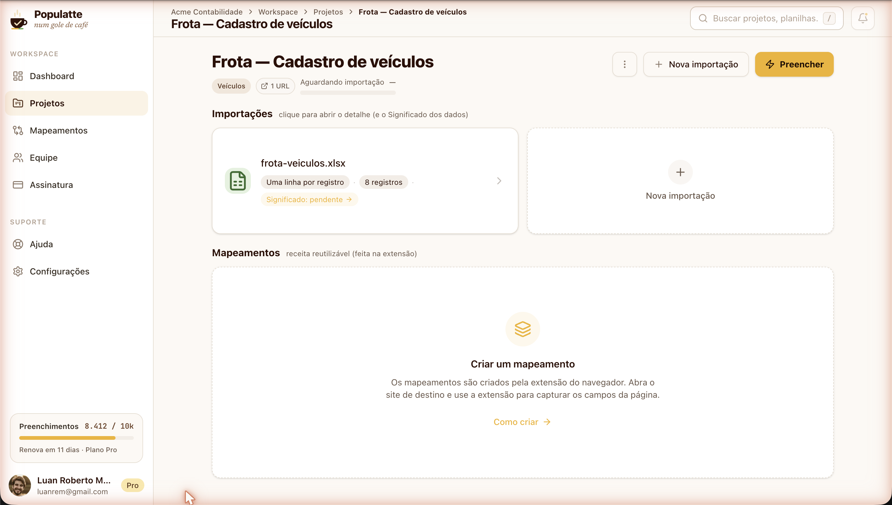

## The sentence I said with too much confidence

A friend of mine owns a mining company. A good part of her administrative work is moving data into government forms, on those old portals that seem built without a thought for whoever ends up doing the typing. In a conversation, I dropped the classic programmer line: "that can't be hard, it's just a robot that fills in the fields."

Then I opened the forms.

It wasn't one form: it was several, chained together, some reloading the whole page after every field. And the data wasn't in a well-behaved spreadsheet with one row per record and a header on top. It was spread across several sheets, each organized its own way: a matrix with the months of the year down the side, a tab where each row was a field rather than a record, loose cells acting as configuration, tabs that play no part in the filling and only exist because someone once needed to check a calculation.

The "fill in the field" part is by far the easiest one. The real problem was two questions: **what does this spreadsheet mean?** and **where does each value go on the form?** Or, the way my programmer brain put it: how would I map the spreadsheet data onto the form?

Populatte was born from that, in mid-2025. The name is *populate* + *latte*: the idea is to flip the role of coffee at the office. Instead of fuel for a long night of typing, it goes back to being just a coffee, sipped in peace while the tedious work happens on its own.

## What it does

A web dashboard where you create a project, upload the spreadsheets, and say what each column means. A browser extension that, on the target site, learns where each value goes: you click the column, click the field, and that becomes a saved recipe. Then it's record by record: the extension fills, you check and submit.

Notice the split in the diagram, because it's the most important architectural decision in the project. There are **two mappings**, not one. The *inbound* one answers "what is this data" and lives in the spreadsheet. The *outbound* one answers "where does it go" and lives on the form. Treating both as one thing is the mistake that sinks this kind of tool on the second spreadsheet: you end up with a direct link between cell B7 and the `#txtProducao` field, and all it takes is someone inserting a row in Excel for everything to break silently. Which is the worst way to break, because the form still gets submitted, just wrong.

## Why a copilot, not an autopilot

The obvious question: if it can fill forms, why not fill everything by itself, no human at all?

Two reasons, and the first is safety. This data isn't trivial. It's a company's tax and operational data going into a government portal, and submitting has consequences. I don't want the first version of a system of mine pressing that button. The second reason is that I want Populatte to work for any form, in any industry, not just the ones I've already seen. For that, someone has to teach the path at least once, and the only honest way to learn it is for a person to open the page and point: this value goes in this field.

So v1 is unapologetically a copilot. The extension fills, the person validates and submits, and the record gets marked. Once enough paths have been recorded, full automation becomes a small step instead of a leap of faith.

## The architecture

Three applications in one monorepo, all TypeScript, with a shared types package in the middle. That package matters more than it seems: the type of a field (what it is, where its value comes from, how it should be written) is defined exactly once and travels through all three applications. When I change that contract, the compiler points at every place that has to change with it, including inside the extension. I'm on the second major data model of this project, and without that, every change would turn into a hunt across the whole repo.

### The dashboard

Next.js 16 with the App Router and React 19, TanStack Query on the client, shadcn/ui on top of Tailwind. The part I like most isn't even a technology: it's that the whole theme lives in tokens. The espresso browns, the gold of the fill button, the status colors of the fill lifecycle, all of it has a name and lives in one place. No component knows a color.

There's a `/design-system` page that shows every primitive with all its variants, and it's the reference for any new screen.

Clerk handles authentication, and that choice was about focus: auth is a solved problem, and I'd rather spend my time on the problem nobody has solved yet.

### The API

NestJS, with actual Clean Architecture: core, infrastructure, and presentation. In a personal project that looks like overkill, and it was a conscious choice. NestJS pushes you toward well-organized code from the start, and since I want this project to live for years and go through big data model changes, I preferred paying for structure upfront over paying for maintenance later. The domain core knows no database, no HTTP, no Drizzle: it declares repository interfaces and leaves infrastructure to implement them.

That paid off during refactors. When I replaced the whole field type vocabulary, the rules that mattered lived in a handful of domain files, testable without booting anything. (And there's one dependency rule violation I haven't paid off yet: one core use case imports the ingestion service from infrastructure. I know it's there, it's in the backlog, and I'd rather write it down here than pretend everything is perfect.)

Each spreadsheet row lives as JSONB in PostgreSQL, with Drizzle on top. Zod validates everything coming in, and in one specific spot it does more than validation: the schema that accepts field edits is strict, so any attempt to send an attribute that should be immutable gets rejected at the API's edge, not three layers deeper. Uploaded files are checked by their actual magic bytes (an `.xlsx` is a ZIP, an old `.xls` is an OLE2 container), because trusting the file extension is trusting whatever name the user gave the file.

### The extension

Manifest V3, built with WXT, with the React UI in Chrome's Side Panel, not in a popup. That difference matters more than it sounds: a popup closes the moment you click the page, which is exactly when you need it open to point at a field.

Manifest V3 forces you to live in three isolated contexts that share no memory: the panel (UI), the background service worker (token, API calls, per-tab state) and the content script, the only one that touches the page's DOM. Everything between them is typed message passing. And the browser can kill the service worker at any moment, so nothing important is allowed to live only in its memory.

## The hard part isn't the fill

### Understanding the spreadsheet

This is the screen that took the most project time, and it answers the first question. When a spreadsheet comes in, the system tries to figure out on its own the format of each tab (is it a monthly matrix? a plain table? a transposed list?), what each column is, and where each field's value comes from. Every proposal carries a confidence level, and whatever lands below the threshold shows up flagged with a "review?" instead of faking certainty. A cell with a formula error doesn't count as type evidence; it becomes a reason to ask for review.

The separation that took me a while to see is between type and format. Type is what the cell is: text, number, date, boolean. Format is how it looks: currency, percentage, date, accounting, the same twelve categories as Excel's Format Cells dialog, because that's the language the person on the other side already speaks. `R$ 78.990,00` is a number displayed as currency. Treating currency as a type seems to work until the day you need to add two of them.

Once everything is labeled, the result becomes a project template, anchored to the header text. On the next upload of the same spreadsheet, if the file's signature matches exactly, the meaning is reapplied on its own, and next month doesn't start from scratch. If it doesn't match, it doesn't guess: it falls back to detection and lets the person decide. And edits save automatically as you type, because on this screen nobody should have to remember a save button.

One decision holds all of this together: every column gets a normalized key at ingestion time, and that key **never changes**. It's the single thread connecting the stored data, the meaning the person assigned, and the fill step at the far end. No foreign key enforces that, so immutability is enforced by domain invariant and by a strict schema at the edge.

### Writing into a DOM that isn't mine

Filling happens live, field by field, on the real page. No generating a file for the site to import: the form is the source of truth, and it's where the person checks the result. Which means the executor has to deal with the world as it is:

- **Portuguese decimals.** `1500.5` must become `1500,5`. But no thousands separator and no fixed precision, because the same code path carries a year (`2024`) and a document number, and pretty formatting would destroy the data.
- **Radio by value.** A column holding `+` or `-` has to check the right button within the group. It looks up the `value` attribute and, failing that, tries the text of the associated label.
- **Fields that don't notice they were filled.** Writing straight to `.value` doesn't tell React, and the value vanishes on the next render. Writes go through the native prototype setter and dispatch the events the page expects, which works on a modern form and on a legacy portal alike.
- **Selectors that age.** During capture, selectors are generated ignoring framework classes and hashed classes, which change on every build, and each step stores a fallback. Before filling, the panel validates every selector against the open page and shows which ones it couldn't find. A mapping that silently points at a field that no longer exists is worse than no mapping at all.

Steps can be optional; a required step that fails aborts the rest and reports exactly which step broke and why. The record gets marked as an error, with the message, instead of counting as done.

### Connecting the extension without sharing a session

An extension doesn't share cookies with the dashboard, and I wasn't going to ask for anyone's password inside a side panel. The flow is a pairing code: logged into the dashboard, you generate a six-digit code and type it into the extension, which exchanges it for a token of its own. The code lives for five minutes, is single use, generating a new one invalidates the previous one, and repeated failures lock attempts out for a while.

One detail I liked: the API accepts two kinds of token, Clerk's and the extension's. Instead of trying to validate and seeing what happens, the guard looks at the algorithm in the token's header and knows right away whose it is. That avoids a noisy log and a verification attempt that could never succeed.

## How I test this without depending on the government's site

Testing a fill engine is annoying for the expected reason: the target is a site that isn't mine, behind a login, and one I definitely don't want to hammer with automated tests.

The solution was an offline lab in Playwright. It bundles the extension's real executor, the same file that runs in production, not a copy, and runs it against locally served forms. One of them is an offline replica of a real government form, generated by a script from a saved page, with scripts stripped and postbacks neutralized, keeping the quirky HTML and the accents. Seven scenarios run today, covering exactly the rules that scare me: Portuguese decimals, radio by value, a required step failing and aborting the rest.

The rest of the API has unit and integration tests in Jest, concentrated where the rules are: format detection, a sheet's readiness, the immutable key, template reapplication. The local database runs in Docker, so every machine gets the same Postgres.

## Where it stands today

It works end to end, on my machine, with real data: upload the spreadsheet, detect the format, label the fields, capture the form's fields through the extension, and fill a record. That has been validated on a test form and against the offline replica of the real government form.

What doesn't exist yet: it isn't deployed, nobody outside has used it, and several dashboard screens are still just placeholders (team, subscription, the overview panel). The extension works, but hasn't been through design yet; its UI is structure, not polish. There's also no billing or real subscription plan yet.

And, to be upfront about the current pace: I'm traveling through Europe. It's not an abandoned project, it's a slow-moving one.

## What comes next

Deploy and an MVP in front of real people, aiming to have that done by December 2026. The order is: ship it, get the first real user filling her forms end to end, and only then look at what I've deferred. On that list are forms that reload the page on every step, repeatable step groups for tables, and the guarantee of never submitting the same record twice.

After that, and only after that, the autopilot.
